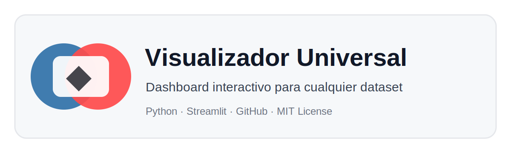

# Visualizador Universal de Datasets




## Objetivo

Desarrollar un visualizador interactivo para explorar datasets con filtros y gráficos configurables desde la interfaz.

Este proyecto sirve como base para crear dashboards rápidos con:

- Carga de archivos CSV y Excel.
- Filtros categóricos.
- Filtros numéricos por rango.
- Gráficos de barras, línea, dispersión, histograma, boxplot, pastel y correlación.
- Descarga del dataset filtrado.

## Estructura del proyecto

```text
03_visualizador_dataset_streamlit/
├── app.py
├── requirements.txt
├── README.md
├── LICENSE
├── .gitignore
├── .streamlit/
│   └── config.toml
├── assets/
│   └── banner.svg
└── data/
    └── dataset_demo.csv
```

## Ejecutar localmente

```bash
python -m venv .venv
.venv\Scripts\activate
pip install -r requirements.txt
streamlit run app.py
```

En Mac/Linux:

```bash
python3 -m venv .venv
source .venv/bin/activate
pip install -r requirements.txt
streamlit run app.py
```

## Despliegue en Streamlit Community Cloud

1. Subir esta carpeta a un repositorio público de GitHub.
2. Verificar que el archivo principal sea `app.py`.
3. Verificar que `requirements.txt` tenga todas las librerías importadas.
4. Crear una app en Streamlit Community Cloud.
5. Seleccionar repositorio, rama y archivo principal.
6. Deploy.

## Reto de mejora

Personalizar el visualizador para un dominio específico:

- Educación.
- Finanzas.
- Salud.
- Producción.
- Ventas.
- Petróleo y gas.

## Licencia

MIT. Puede ser usado, modificado y adaptado para fines académicos.
